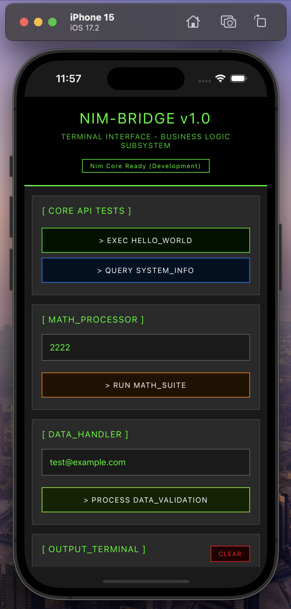
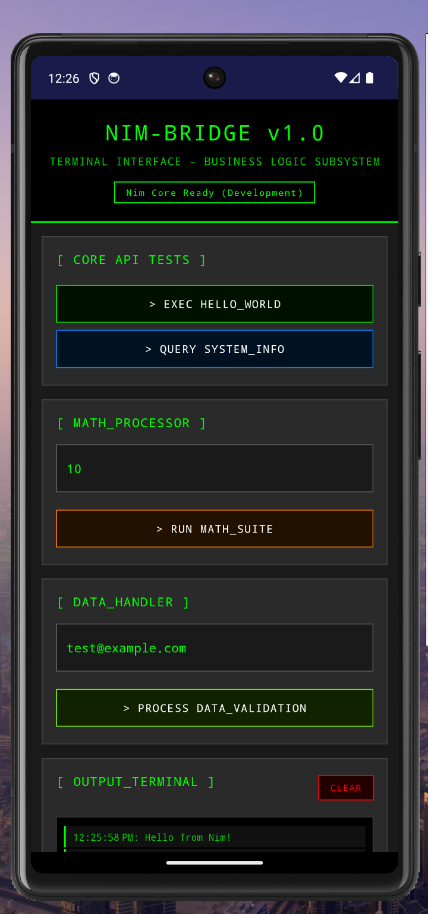

# React Native + Nim

**Automatic binding generation for Nim business logic in React Native apps**

<div align="center">

| iOS |                                                                                        | Android |
|-----|----------------------------------------------------------------------------------------|---------|
|  |  |  |

</div>

Write your business logic in Nim, get React Native bindings automatically. Inspired by go-mobile and status-go/status-mobile.

## Quick Start

### Create a new project

```bash
npx create-react-native-nim my-app
```

Or clone and run the CLI locally:

```bash
git clone https://github.com/siddarthkay/react-native-nim.git
cd react-native-nim
node cli/bin/create-react-native-nim.js my-app
```

Then follow the printed steps:

```bash
cd my-app
yarn install
make build-nim        # Compile Nim + generate all bridge code
yarn ios              # or yarn android
```

### Prerequisites

- **Node.js** 18+
- **Nim** 2.0+ (`brew install nim` on macOS)
- **Python 3** (for binding generator)
- **Xcode** (iOS) / **Android SDK** (Android)

Or use the included Nix flake for a reproducible environment:

```bash
nix develop
```

## Development (Demo App)

The demo app in `mobile-app/` uses Makefiles for all build operations:

```bash
nix develop                        # Enter reproducible dev environment (optional)
make setup                         # Install Node dependencies
make ios                           # Build Nim backend + iOS app
make android                       # Build Nim backend + Android app
make help                          # Show all available targets
```

### Make Targets

| Target | Description |
|--------|-------------|
| `make setup` | Install Node dependencies |
| `make ios` | Build Nim + iOS app (full pipeline) |
| `make android` | Build Nim + Android app (full pipeline) |
| `make clean` | Clean all build artifacts |
| `make clean-all` | Clean everything including Nim caches |

Sub-project targets (run from `mobile-app/`):

| Target | Description |
|--------|-------------|
| `make build-nim` | Compile Nim + static lib + bindings + headers |
| `make nim-compile` | Compile Nim to C files only |
| `make nim-static-lib` | Compile C files into static library |
| `make nim-bindings` | Generate TypeScript/iOS/Android bridge code |
| `make build-ios` | Full iOS build pipeline |
| `make build-android` | Full Android build pipeline |
| `make run-ios` | Dev build + deploy to iOS Simulator |
| `make run-android` | Dev build + deploy to Android emulator |
| `make clean-nim` | Clean Nim build artifacts |
| `make help` | Show all targets |

## How It Works

```
Nim Source Code          Auto Generator          React Native App
(Business Logic)   -->  (Python Script)    -->  (TypeScript/UI)
   {.exportc.}          iOS + Android + TS       Type-safe calls
```

### 1. Write Nim functions

Add exported functions in `nim/nimbridge.nim`:

```nim
proc calculateTax*(income: cint, rate: cint): cint {.exportc.} =
  return (income * rate) div 100

proc greet*(name: cstring): cstring {.exportc.} =
  ## @allocated
  return allocCString("Hello, " & $name & "!")
```

### 2. Generate bindings

```bash
make build-nim          # from mobile-app/ or scaffolded projects
```

This automatically generates:
- **iOS**: C++ wrapper + Objective-C++ bridge + static library
- **Android**: JNI bridge + Kotlin TurboModule + CMake config
- **TypeScript**: TurboModule spec with full type safety

### 3. Use in React Native

```typescript
import { NimCore } from './modules/nim-bridge/src/index';

const tax = NimCore.calculateTax(50000, 20);
const greeting = NimCore.greet("World");
```

## Supported Types

| Nim Type | TypeScript | Notes |
|----------|-----------|-------|
| `cint` | `number` | 32-bit integer |
| `int64` | `number` | 64-bit integer |
| `cstring` | `string` | C-compatible string |
| `bool` / `cint` | `boolean` | Use `boolean_returns` in config |
| `float` | `number` | Double precision |

## Project Structure

```
react-native-nim/
├── Makefile                 # Root orchestration (make ios, make android)
├── mobile-app/              # Demo app
│   ├── Makefile             # Build targets (build-nim, build-ios, etc.)
│   ├── nim/                 # Nim business logic
│   │   ├── nimbridge.nim    # Exported functions ({.exportc.})
│   │   └── nimbridge.nimble # Nim dependencies
│   ├── modules/nim-bridge/  # Auto-generated bridge code
│   │   ├── src/             # TypeScript TurboModule spec
│   │   ├── ios/             # Objective-C++ bridge + static lib
│   │   └── android/         # Kotlin module + JNI bridge
│   ├── src/App.tsx          # React Native app (retro terminal UI)
│   └── tools/
│       ├── generator_config.json  # Binding generator config
│       └── bindings/        # Python generator package
├── cli/                     # create-react-native-nim CLI tool
└── flake.nix                # Nix development environment
```

## Configuration

Customize binding generation in `tools/generator_config.json`:

```json
{
  "function_name_mappings": {
    "myNimFunc": "myJsName"
  },
  "boolean_returns": ["myNimFunc"],
  "type_mappings": { ... }
}
```

## Troubleshooting

**Build fails with "Symbol not found"**
```bash
make clean-nim          # from mobile-app/
make build-nim
make pod-install
```

**Metro bundler errors**
```bash
yarn react-native start --reset-cache
```

**Nim not found**
```bash
nim --version  # Should be 2.0+
brew install nim  # macOS
# or use: nix develop
```

## Architecture

- **TurboModules / JSI** - React Native New Architecture
- **Static library** (iOS) / **Shared library** (Android) - compiled from Nim
- **Automatic code generation** - no manual bridge code

## License

MIT - see [LICENSE](LICENSE).

## Inspiration

- [go-mobile](https://pkg.go.dev/golang.org/x/mobile) - Go bindings for mobile
- [status-mobile](https://github.com/status-im/status-mobile) - Real-world Go/mobile integration
- [Nim](https://nim-lang.org/) | [React Native](https://reactnative.dev/) | [Expo](https://expo.dev/)
