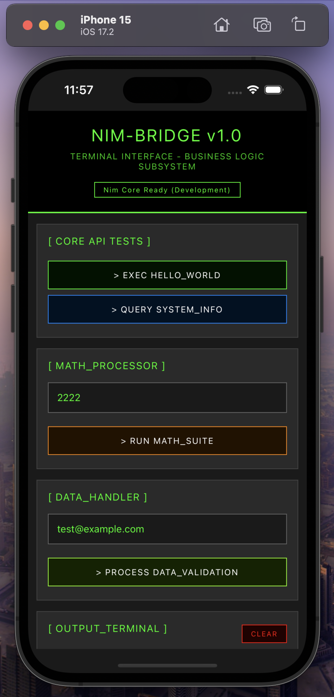

# React Native + Nim Integration

**Template with automatic binding generation for Nim → React Native**

<div align="center">

| iOS | Android |
|-----|---------|
|  |  |

</div>

A template for integrating Nim business logic into React Native apps with **automatic binding generation** 
inspired by go-mobile and the status-go/status-mobile architecture.

## Features

- **Automatic Binding Generation** - Write Nim, get React Native bindings automatically
- **Cross-Platform** - Works on iOS and Android  
- **Type Safe** - Full TypeScript support with auto-generated types
- **Zero Manual Work** - No hand-written bridge code needed
- **Monorepo Structure** - Organized like status-go/status-mobile
- **Modern Tooling** - React Native 0.76.9, Expo SDK 52, Nim 2.2.0

## Architecture Overview

This project demonstrates a **separation of concerns** between business logic (Nim) and UI (React Native), 
similar to how status-go provides backend services to status-mobile.

```
react-native-nim/
├── nim-core/               #  Business Logic (Nim)
├── bindings/               #  Generated C Bindings  
├── mobile-app/             #  React Native App with Auto-Generation
│   ├── nim/                #  Nim source code
│   ├── tools/              #  Automatic binding generator
│   └── modules/nim-bridge/ # Generated bridge code
├── tools/                  # ️ Build Automation
```

## Quick Start

### Prerequisites

#### Option 1: Using Nix (Recommended)

This project includes a Nix flake that provides all required development tools.

```bash
# Install Nix if you haven't already
curl -L https://nixos.org/nix/install | sh

# Enter the development environment
nix develop

```

The Nix environment includes:
- Node.js 20
- Python 3
- Nim compiler 2.2+
- Git and build tools
- Android SDK (in default shell)
- All required dependencies

**Tip:** For automatic environment loading, install [direnv](https://direnv.net/):
```bash
# Install direnv
brew install direnv  # macOS
# or: nix-env -iA nixpkgs.direnv

# Allow direnv for this project
direnv allow

# Now the environment loads automatically when you cd into the project!
```

#### Option 2: Manual Installation

- **Node.js**  18+ 
- **Nim**      2.0+ (`brew install nim` on macOS)
- **Xcode**    (for iOS development)
- **Python 3** (for binding generator)

### Installation

```bash
# Clone the repository
git clone https://github.com/siddarthkay/react-native-nim.git
cd react-native-nim

# Go to the mobile app
cd mobile-app

# Install dependencies
yarn install

# Install iOS dependencies
cd ios && pod install && cd ..

# Build Nim bindings
yarn build:nim

# Run on iOS
yarn ios

# Run on Android
yarn android
```

## How It Works

### 1. Write Nim Functions

Create your business logic in `mobile-app/nim/nimbridge.nim`:

```nim
# mobile-app/nim/nimbridge.nim
proc calculateTax*(income: cint, rate: cint): cint {.exportc.} =
  return (income * rate) div 100

proc validateCreditCard*(cardNumber: cstring): cint {.exportc.} =
  # Your validation logic here
  if len($cardNumber) == 16: return 1
  return 0
```

### 2. Generate Bindings Automatically

```bash
cd mobile-app
yarn build:nim
```

This **automatically generates**:
- **C++ wrapper** (`modules/nim-bridge/ios/nim_functions.h`)
- **Objective-C++ bridge** (`modules/nim-bridge/ios/NimBridge.mm`) 
- **TypeScript interfaces** (`modules/nim-bridge/src/NimBridge.types.ts`)

### 3. Use in React Native

```typescript
import { NimCore } from './modules/nim-bridge/src/index';

// Type-safe calls to your Nim functions
const tax = NimCore.calculateTax(50000, 20); // Returns 10000
const isValid = NimCore.validateCreditCard("1234567890123456"); // Returns true
```

### Supported Types

| Nim Type | TypeScript Type | Notes |
|----------|----------------|-------|
| `cint` | `number` | 32-bit integer |
| `cstring` | `string` | C-compatible string |
| `bool` → `cint` | `boolean` | 0/1 conversion |

## Demo App

The included demo app showcases:

- **Math Operations** (Fibonacci, Prime checking, Factorization)
- **Data Validation** (Email validation, User creation)
- **System Info** (Version reporting)
- **Error Handling** (Graceful error management)

### **Architecture**

```
┌─────────────────┐    ┌──────────────────┐    ┌─────────────────┐
│   Nim Source    │───▶│  Auto Generator  │───▶│  React Native   │
│ (Business Logic)│    │  (Python Script) │    │      (UI)       │
└─────────────────┘    └──────────────────┘    └─────────────────┘
```

1. **Nim Layer**: Pure business logic with `{.exportc.}` pragma
2. **Generator Layer**: Automatic C++/ObjC/TypeScript bridge generation  
3. **React Native Layer**: Type-safe consumption of Nim functions

### Type Mapping

The binding generator automatically maps types:

```python
# mobile-app/tools/generate_bindings.py
def nim_to_ts_type(nim_type):
    type_map = {
        'cstring': 'string',
        'cint': 'number',
        'bool': 'boolean',
    }
    return type_map.get(nim_type, 'any')
```

## Troubleshooting

### Common Issues

**Build fails with "Symbol not found"**
```bash
# Clean and rebuild
cd mobile-app
rm -rf nim/cache
yarn build:nim
cd ios && pod install && cd ..
```

**Metro bundler errors**
```bash
# Reset Metro cache
yarn react-native start --reset-cache
```

**Nim compilation errors**
```bash
# Check Nim version
nim --version  # Should be 2.0+
```

## License

This project is licensed under the MIT License - see the [LICENSE](LICENSE) file for details.

## Inspiration

Inspired by:
- [go-mobile](https://pkg.go.dev/golang.org/x/mobile) - Go bindings for mobile
- [status-mobile](https://github.com/status-im/status-mobile) - Real-world Clojure/Go integration
- React Native's philosophy of "learn once, write anywhere"

## Learn More

- [Nim Language](https://nim-lang.org/) - Efficient, expressive, elegant
- [React Native](https://reactnative.dev/) - Learn once, write anywhere
- [Expo](https://expo.dev/) - Platform for universal React applications

---

*Questions? Open an issue or join the discussion!*
